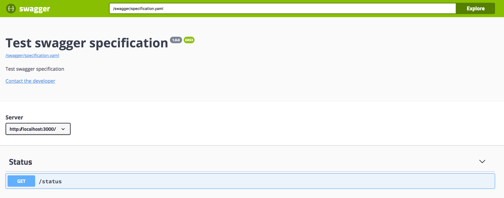

`fastify-serve-swagger-ui` serves [swagger UI](https://swagger.io/swagger-ui/) for your fastify instance, at the same time allowig you to inject swagger specification of your choice as default speficiation.

## install

```
npm i fastify-serve-swagger-ui
```

## usage

### file
```js
const fastify = require("fastify")();
fastify.register(require("fastify-serve-swagger-ui"), {
  // swagger specification which should be exposed
  specification: {
    type: "file",
    path: "./var/examples/example.yaml"
  },
  // path under which swagger-ui will be available
  path: "swagger"
});

const start = async () => {
  try {
    await fastify.listen(3000);

    console.log(`server listening on ${fastify.server.address().port}`);
  } catch (err) {
    console.error(err);
    process.exit(1);
  }
};

start();
```

Given that `./var/examples/example.yaml` is the path which is relative to the root of the project. You can then open http://localhost:3000/swagger/ and see the swagger-ui which shows your specification.

Example:


### url
Another variant is to provide the specification fot the `url`, you can pass the object like this:

```
{
	specification: {
		type: "url",
		url: "http://petstore.swagger.io/v2/swagger.json"
	},
	path: 'swagger'
}
```

Basic working example is located under [var/examples/simple.js](var/examples/simple.js).

## other
`fastify-serve-swagger-ui` works wunderfully with [fastify-blipp](https://github.com/PavelPolyakov/fastify-blipp), try it out!
